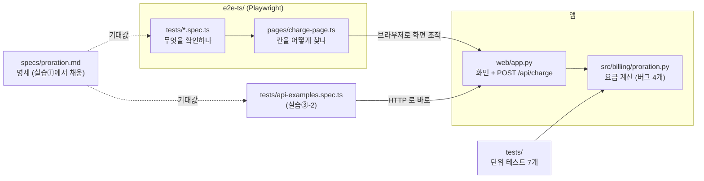
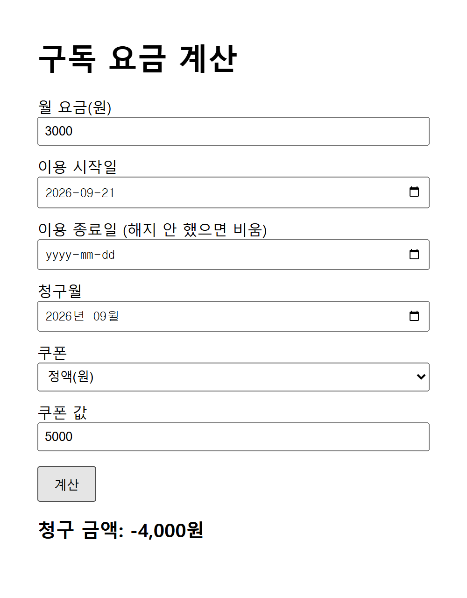
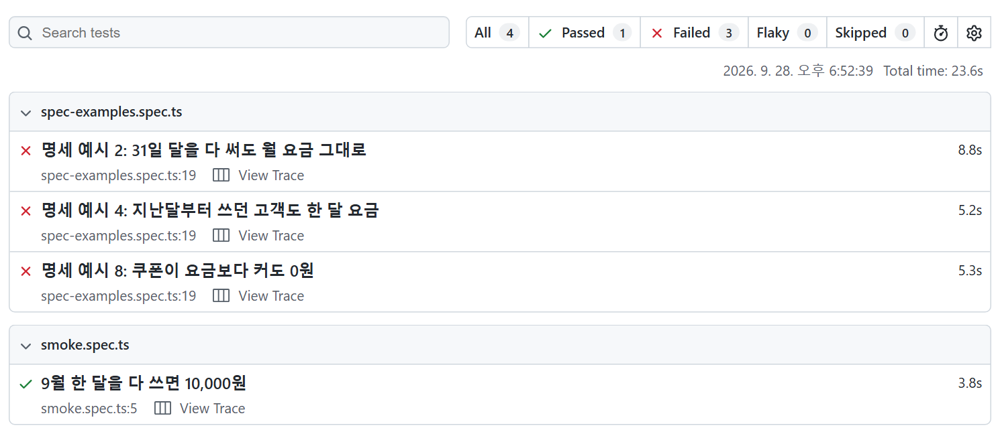
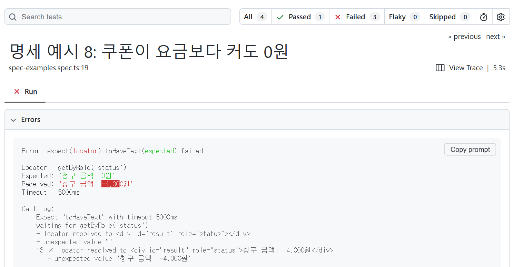
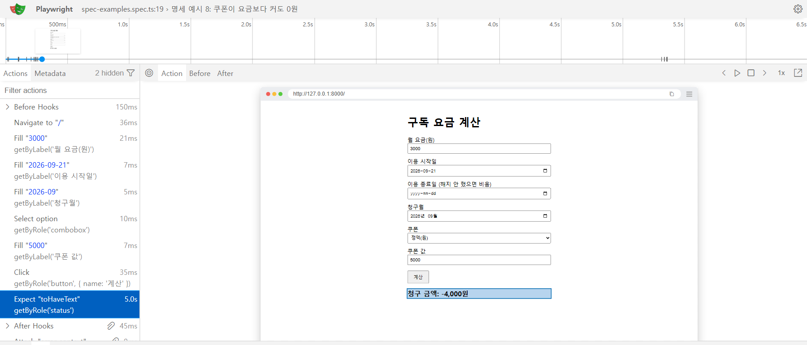
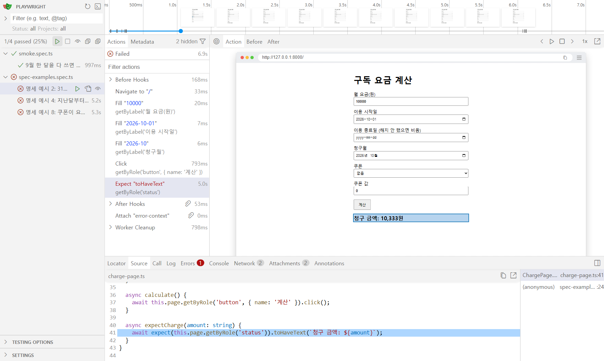
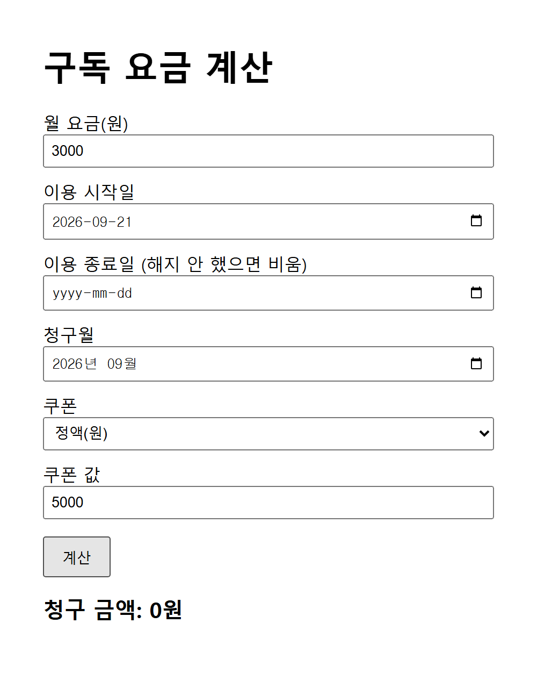
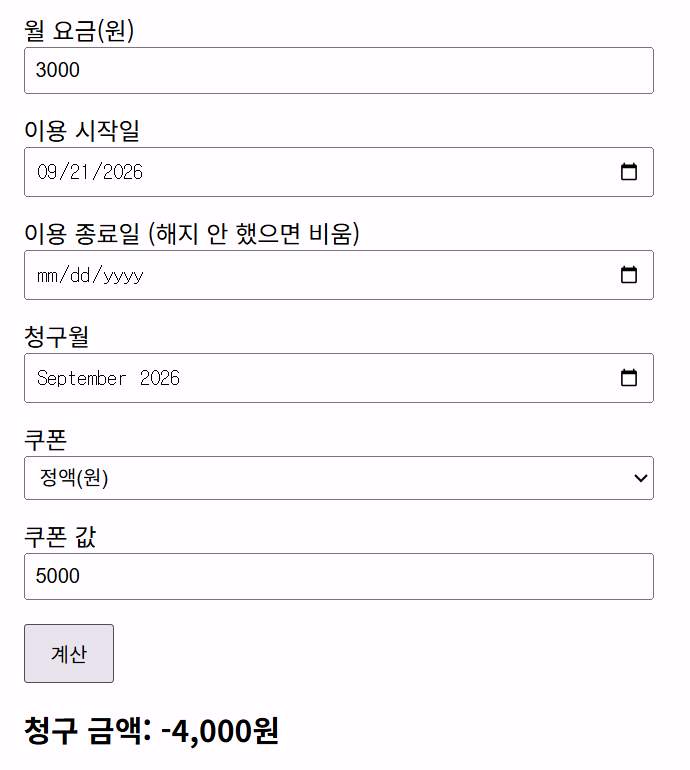
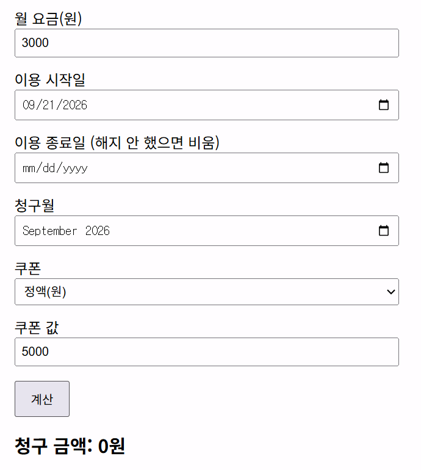

# 강사 가이드 — 실습 저장소 상세 따라 하기 (정답 포함)

이 문서는 강사와, 강의가 끝난 뒤 혼자 다시 해 보는 사람을 위한 것입니다. 참가자는 [HANDS_ON.md](../HANDS_ON.md) 만 따라가면 됩니다. 이 문서는 HANDS_ON 을 한 단계씩 풀어서 네 가지를 적었습니다.

- 단계마다 **화면에 실제로 무엇이 나오는지**
- 카드를 붙여 넣었을 때 **AI 가 실제로 어떻게 답했는지**
- **정답**이 무엇이고 무엇을 보고 "됐다" 고 판단하는지
- **막히면** 어떻게 하는지

화면 출력은 2026-10-06 에 이 저장소를 새로 받아 문서 순서대로 실행한 결과입니다(Windows 11, Python 3.14, Node 24, Playwright 1.60). AI 답은 Claude 에게 카드를 그대로 보내서 받은 것입니다. AI 답은 할 때마다 조금씩 다르니 **모양과 흐름을 보는 용도**로 쓰세요.

강의 전에 이 문서대로 한 번 끝까지 해 보기를 권합니다. 준비 10분, 실습 ①~⑤ 약 50분 걸립니다. 처음 상태로 되돌리는 방법은 11절에 있습니다.

---

## 1. 이 저장소는 무엇인가

**버그가 있는 작은 요금 계산 웹 화면 하나**와, 그 화면을 검증하는 테스트, 그리고 AI 에게 보낼 **프롬프트 카드**로 이루어져 있습니다.



앱은 이렇게 돕니다. 화면에서 월 요금 · 시작일 · 종료일 · 청구월 · 쿠폰을 넣고 [계산]을 누르면, 화면이 `POST /api/charge` 를 부릅니다. 서버(`web/app.py`)는 `src/billing/proration.py` 의 `calculate_charge` 로 금액을 계산하고, 화면에 "청구 금액: N원" 이 뜹니다.



`src/billing/proration.py` 는 "AI 가 짠 코드" 역할입니다. AI 가 같이 짠 단위 테스트 7개가 전부 통과하고, 라인 커버리지도 93% 입니다. 그런데 버그가 4개 있습니다(정답은 5절). 오늘의 줄거리는 "테스트가 다 초록인데 틀린 코드를, 명세와 화면 끝까지 가는 테스트(E2E)로 잡는다" 입니다.

E2E 테스트는 Playwright 가 브라우저를 띄워 사람처럼 칸을 채우고 버튼을 누른 뒤, 화면에 나온 글자를 확인합니다. 테스트를 돌리면 `e2e-ts/playwright.config.ts` 의 `webServer` 설정이 **앱을 자동으로 띄우고, 끝나면 끕니다.** 그래서 앱을 따로 띄울 필요가 없습니다. 오히려 따로 띄워 두면 "8000 포트가 이미 쓰인다" 는 오류로 테스트가 시작조차 안 됩니다.

화면의 칸을 **어떻게 찾는지**("월 요금(원)" 이라는 라벨로 찾는다 등)는 `e2e-ts/pages/charge-page.ts` 한 곳에만 있습니다. 이런 파일을 페이지 객체(Page Object)라고 부릅니다. 테스트 파일에는 **무엇을 확인하는지**(입력값과 기대 금액)만 있습니다. 화면 문구가 바뀌면 테스트가 아니라 이 파일만 고치면 됩니다. 실습④ 가 바로 이 상황입니다.

### 폴더 한눈에

- `specs/` — 명세. `proration.md` 는 실습① 에서 채울 빈 명세, `TEMPLATE.md` 는 실습⑤ 에서 쓸 빈 틀, `RELEASE_CHECKLIST.md` 는 출시 전 QA 점검 리스트 예시입니다.
- `src/billing/proration.py` — 버그가 있는 계산 코드. 실습② · ③ 의 대상입니다.
- `web/app.py` — 화면과 API. 표준 라이브러리만 씁니다. `python web/app.py` 로 직접 띄우면 http://127.0.0.1:8000 에서 볼 수 있습니다.
- `tests/` — 단위 테스트 7개(pytest). 9월(30일 달)만, 1일이나 달 안에서 시작하는 경우만 봅니다. 그래서 버그를 못 잡습니다.
- `e2e-ts/` — Playwright E2E. `pages/` 는 화면 객체, `tests/` 는 테스트입니다. 처음에는 `smoke.spec.ts` 하나(9월 한 달 = 10,000원)만 있습니다.
- `prompts/` — AI 에게 보낼 카드. 쓰는 순서는 01(실습①) → 02 · 03(실습③) → 06(실습③-2) → 04(실습④) → 07(실습⑤, 앱 팀)입니다. 05(리뷰어)와 `보너스_*` 는 시간이 남을 때 씁니다.
- `tools/` — `check_setup.py` 는 환경 점검, `lab4_change.py` 는 실습④ 의 "동료 PR" 적용과 되돌리기, `mutate.py` 는 보너스 뮤테이션 채점입니다.
- `instructor/` — 이 문서와 정답 파일. 정답 명세, 고친 코드, 정답 E2E · API 테스트, 정답 단위 테스트가 있습니다.
- `AGENTS.md` · `CLAUDE.md` — AI 코딩 도구가 이 저장소에서 지킬 규칙입니다. `CLAUDE.md` 는 `@AGENTS.md` 한 줄이라, Claude Code 도 AGENTS.md 를 읽습니다. "테스트 고치지 말기", "E2E 실패는 분류부터", "돈 계산은 정수만" 이 들어 있습니다.
- `.claude/settings.json` — Claude Code 가 파일을 고칠 때마다 단위 테스트를 자동으로 돌리는 훅입니다. 실패하면 Claude 가 그 결과를 보고 다시 고칩니다. 강의의 "AI 편집마다 테스트" 관문을 실제로 보여 주는 장치입니다.
- `.github/` — PR 마다 단위 테스트와 E2E 를 돌리는 CI(`workflows/ci.yml`), AC 이행 현황 표가 든 PR 템플릿, "테스트 파일 변경은 따로 승인" 을 거는 CODEOWNERS 예시가 있습니다.
- `maestro/` — 같은 명세 예시를 앱 테스트 도구 Maestro 로 쓴 보너스입니다(Java 17 이상과 Maestro 설치가 필요합니다).
- `e2e/` — 같은 E2E 를 파이썬 Playwright 로 쓴 선택 버전입니다. 강의에서는 쓰지 않습니다.
- `docs/images/` — HANDS_ON 과 이 문서의 그림입니다.

### 실습이 이어지는 방식

실습은 **같은 폴더에서 이어집니다.** 앞 실습이 남긴 상태(커밋)에서 다음 실습이 시작됩니다.

1. 실습①: 명세를 채우고 **커밋**합니다.
2. 실습③: 테스트를 만들고 **커밋**합니다. 그다음 코드를 고치고 **커밋**합니다.
3. 실습③-2: API 테스트를 넣고 **커밋**합니다.
4. 실습④: 동료 PR 을 넣고 **커밋**한 뒤 분류하고 고칩니다.

커밋을 자주 하는 이유는 하나입니다. **`git diff` 로 "AI 가 무엇을 바꿨는지" 를 보려면, 바꾸기 직전 상태가 커밋돼 있어야 합니다.** 특히 "AI 가 테스트를 몰래 고쳐서 초록불을 만들었는지" 는 `git diff -- tests e2e-ts/tests` 가 비어 있는지로만 확인할 수 있습니다.

뒤처진 사람은 `instructor/` 의 정답 파일을 복사하면 다음 실습을 같은 상태에서 시작할 수 있습니다. 명령은 각 실습 절에 있습니다.

---

## 2. AI 도구에 카드를 보내는 법 (처음이라면 꼭 읽기)

카드는 `prompts/` 의 md 파일입니다. 각 카드에서 **회색 상자(```) 안의 글이 AI 에게 보낼 내용**이고, 상자 밖은 사람이 읽는 설명입니다.

카드 안의 `(여기에 specs/proration.md 붙여 넣기)` 같은 줄은 도구에 따라 다르게 처리합니다.

- **저장소 폴더를 여는 도구**(Claude Code, Cursor, Copilot 에이전트 모드): 그 줄을 지우고 "specs/proration.md 를 읽고" 처럼 파일 이름으로 대신합니다. AI 가 파일을 직접 읽고, 직접 고칩니다.
- **웹 채팅**(claude.ai, ChatGPT 등): 파일을 열어 내용을 그 자리에 붙여 넣습니다. AI 는 파일을 고칠 수 없습니다. AI 가 준 결과를 내가 파일에 붙여 넣고 저장해야 합니다. 그래서 실습마다 3분쯤 더 걸립니다.

카드에 **"새 대화에서"** 라고 적혀 있으면(카드 02 · 06 · 07 · 보너스) 대화를 새로 시작합니다. Claude Code 는 `/clear`, Cursor · Copilot 은 새 채팅, 웹 채팅은 새 대화입니다. 이유는 앞 대화에서 본 코드를 테스트가 베끼지 않게 하기 위해서입니다. 코드를 본 AI 가 만든 테스트는 코드의 가정(예: "한 달은 30일")을 그대로 따라갑니다.

**Claude Code 를 처음 쓴다면**

```bash
cd sdd-qa-lab
claude
```

1. 처음 열면 "이 폴더를 믿느냐(trust)" 를 묻습니다. 실습 폴더이니 Yes 를 고릅니다.
2. Claude 가 파일을 고치거나 명령을 실행하려 할 때마다 허락을 묻습니다. 무엇을 하려는지 읽고 Yes 를 고릅니다. 실습④ 의 "테스트 파일을 고치려 하는지" 를 보는 것도 이 순간입니다.
3. 이 저장소에서는 Claude 가 파일을 고칠 때마다 단위 테스트가 자동으로 돕니다(`.claude/settings.json`). 실패하면 Claude 가 그 결과를 받아 다시 고칩니다. 윈도우에서는 Git Bash 가 있어야 이 훅이 돕니다.

---

## 3. 강의 전 준비 (10분)

참가자에게 강의 전에 해 오라고 공지하는 단계입니다. 강사도 같은 PC 에서 한 번 해 둡니다.

**필요한 것**: Python 3.10 이상, Node.js 20 이상(LTS), git, AI 코딩 도구 하나(로그인까지).

```bash
git config --global user.name "내 이름"      # git 을 처음 쓰는 PC 만
git config --global user.email "내 메일"

git clone https://github.com/diqksrk/ai-auto-practice.git sdd-qa-lab
cd sdd-qa-lab
python -m pip install -r requirements.txt
python -m pytest
```

폴더 이름을 꼭 `sdd-qa-lab` 로 받습니다. 카드와 강의 화면의 경로가 이 이름 기준입니다.

`python -m pytest` 의 실제 출력은 이렇습니다. **`7 passed` 가 나오면 됩니다.**

```
.......                                                                  [100%]
7 passed in 0.02s
```

pip 설치 끝에 `[notice] A new release of pip is available` 이 나올 수 있습니다. 오류가 아니라 안내입니다. PowerShell 에서는 빨간 글씨로 보이지만 무시해도 됩니다.

**먼저 확인 — 이 PC 의 파이썬 명령이 `python` 인가 `py` 인가.** 윈도우에서는 `py` 로만 실행되는 PC 가 흔합니다. 그런 PC 는 이 문서의 `python` 을 `py` 로 바꿔 씁니다. E2E 는 테스트 전에 앱을 `python` 명령으로 띄우므로, 그 창에서 한 번 이렇게 정해 둡니다.

```bash
export PYTHON=py          # Git Bash · macOS · Linux — 이 창을 닫기 전까지 유지
$env:PYTHON="py"          # PowerShell — 이 창을 닫기 전까지 유지
```

창을 새로 열면 다시 해야 합니다. 이걸 안 하면 `npx playwright test` 에서 아래 오류가 납니다(실제 출력). 첫 줄은 윈도우 콘솔에서 한글이 깨져 보일 수 있습니다.

```
[WebServer] 'python'은(는) 내부 또는 외부 명령, 실행할 수 있는 프로그램, 또는 배치 파일이 아닙니다.
Error: Process from config.webServer was not able to start. Exit code: 1
```

이어서 Playwright 를 설치하고 화면 테스트를 한 번 돌립니다.

```bash
cd e2e-ts
npm install
npx playwright install chromium     # 브라우저 약 300MB — 강의장 와이파이 말고 미리!
npx playwright test
cd ..
```

`npx playwright test` 의 실제 출력입니다. **`1 passed` 가 나오면 준비 끝입니다.**

```
Running 1 test using 1 worker

  ok 1 tests\smoke.spec.ts:5:5 › 9월 한 달을 다 쓰면 10,000원 (3.8s)

  1 passed (5.0s)
```

막히면 키트 폴더에서 `python tools/check_setup.py` 를 실행합니다. 빠진 것과 할 일을 한 번에 알려 줍니다. 아래는 `export PYTHON=py` 를 한 창에서, `npm install` 전에 실행했을 때의 실제 출력입니다. `PYTHON` 을 안 정했으면 6번째 줄이 `'python'` 으로 나오고, 그 명령이 없는 PC 는 `[!!]` 가 됩니다.

```
실습 환경 점검

  [OK] Python 3.14.4 (3.10 이상 필요)
  [OK] pytest 설치됨
  [OK] git
  [OK] git 이름 · 이메일 설정 (실습에서 커밋합니다)
  [OK] 키트 폴더가 git 저장소
  [OK] E2E 가 앱을 띄울 파이썬 명령 'py'
  [OK] Node.js v24.14.1 (20 이상 필요)
  [OK] npx
  [!!] @playwright/test 없음
        → cd e2e-ts → npm install → npx playwright install chromium (약 300MB, 미리) → 이 점검을 한 번 더
  [OK] 8000번 포트 비어 있음

고칠 것 1가지가 있습니다. 위의 → 를 따라 하세요.
```

설치를 마치고 다시 돌리면 `[!!]` 줄이 `[OK] @playwright/test 1.60.0 설치됨` 과 `[OK] Playwright 브라우저 chromium-1223` 두 줄로 바뀌고, 마지막 줄이 `준비 끝 — python -m pytest 와 (e2e-ts 에서) npx playwright test 를 돌려 보세요.` 로 바뀝니다.

---

## 4. 실습① 명세 쓰기 (7분)

**무엇을 하나**: 기획자 메모 한 단락을, 번호 붙은 규칙과 숫자로 된 예시(AC, 인수 기준)로 바꿉니다. 이때 AI 를 "구현자" 가 아니라 "질문하는 사람" 으로 씁니다. 모르는 것은 추측하지 않고 `[확인 필요]` 로 남깁니다.

**왜 하나**: 메모에는 "쓴 날만큼만" 이라고만 써 있습니다. 시작일과 해지일 당일을 넣는지, 한 달을 30일로 보는지, 쿠폰이 금액보다 크면 어떻게 하는지는 써 있지 않습니다. 이 빈칸을 AI 가 혼자 추측해 채운 것이 지금의 버그 코드입니다.

**순서**

1. `specs/proration.md` 맨 위의 기획 메모를 읽습니다(1분). 민원 1위가 "해지했는데 요금이 더 나왔다" 입니다.
2. `prompts/01_명세_인터뷰.md` 의 상자 안 글을 AI 에게 보냅니다. Claude Code 라면 마지막 줄 `(여기에 specs/proration.md 내용 붙여 넣기)` 대신 "specs/proration.md 를 읽고" 라고 씁니다.
3. AI 가 질문을 10개쯤 합니다. **위에서 5개만 직접 답하고**, 나머지는 카드 아래 "강사 기본값" 7줄을 그대로 붙여 넣어 답합니다(3분).
4. AI 가 채운 규칙과 예시 표를 확인합니다(3분).
5. 커밋합니다.

```bash
git add specs/proration.md
git commit -m "명세"
```

**AI 가 실제로 한 질문** (2026-10-06, 10개 중 앞 5개를 줄여 옮김)

> 1. 시작일과 종료일(해지일) 당일을 이용일수에 넣나요? → 정하지 않으면: 9/1 가입 · 9/15 해지 고객이 5,000원 또는 4,666원. 해지일까지 받으면 "해지했는데 하루치가 더 나왔다" 민원.
> 2. 청구월 밖의 날은 어떻게 하나요? → 8/20 가입 고객의 9월분을 시작일부터 세면 42일 → 14,000원.
> 3. 한 달을 실제 날짜 수로 나누나요, 30일로 고정하나요? → 30일 고정이면 10월을 다 쓴 고객에게 10,333원.
> 4. 쿠폰 할인이 청구 금액보다 크면? → 9/29 가입(2일, 666원) 고객에게 1,000원 정액 쿠폰을 그대로 빼면 −334원 청구서(환불)가 나갑니다.
> 5. 쿠폰은 일할한 금액에 적용하나요, 월 요금에 먼저 적용하나요? → 9/21 가입(10일)에 1,000원 정액 쿠폰: 일할 뒤 적용 2,333원, 먼저 적용 3,000원. 같은 쿠폰인데 667원 차이.
>
> (6~10: 원 미만 처리 시점, 정률 쿠폰의 최대 할인 한도, 정률 할인액의 원 미만, 쿠폰 여러 장, 입력 오류의 범위)

질문 2 · 3 · 4 가 **지금 코드의 버그 그대로**라는 점을 강의에서 짚어 주세요. AI 에게 "짜라" 고 하면 추측해서 넘어갈 빈칸을, "물어라" 고 하면 이렇게 꺼내 놓습니다.

**참가자가 보낸 답** — 카드 대로 1~5 는 직접, 나머지는 강사 기본값.

```
1. 둘 다 포함
2. 청구월 밖의 날은 안 센다. 지난달부터 쓰던 고객은 청구월 1일부터, 청구월과 안 겹치면 0원
3. 그 달의 실제 날짜 수
4. 0원. 다음 달로 안 넘긴다
5. 일할한 금액에 적용
나머지는 아래 기준으로 해 줘.
(카드의 강사 기본값 7줄)
```

**AI 가 채운 결과** (규칙 일부와 예시 표에서 몇 행)

```
- R2 일할 금액 — 월 요금 × 이용일수 ÷ 그 달 날짜 수. 그 달 날짜 수는 실제 값(28·29·30·31)을 쓴다.
  원 미만은 버린다. 곱한 다음 나누는 정수 연산으로 계산하고, 버림은 결과에 한 번만 한다.
- R5 청구액 0원 하한 — 쿠폰을 적용한 결과가 0보다 작으면 청구액은 0원이다.

| 4 | 10,000 | 2026-10-01 | 없음       | 2026-10 | 없음       | 10,000 (31일 달, 10,000 × 31 ÷ 31) | R2 |
| 7 | 10,000 | 2026-08-20 | 2026-09-10 | 2026-09 | 없음       | 3,333 (지난달부터 이용, 9/1~9/10 = 10일만) | R3 |
| 8 | 3,000  | 2026-09-21 | 없음       | 2026-09 | 정액 5,000 | 0 (1,000 − 5,000 = −4,000 → 0) | R4, R5 |

## 6. 열린 질문
- [확인 필요] 정률 쿠폰의 최대 할인 금액 — 일부만 쓴 달에도 한도를 그대로 쓰나, 이용일수만큼 줄이나?
- [확인 필요] 한 청구에 쿠폰을 여러 장 쓸 수 있나? 쓸 수 있다면 순서는?
- [확인 필요] 정액 쿠폰 금액이 음수면 오류인가? R6 목록에 없다.
```

이번에 AI 는 예시 16행과 `[확인 필요]` 5개를 채웠습니다. 질문 6~10 중 강사 기본값에 없는 것(최대 할인 한도, 쿠폰 여러 장)을 추측하지 않고 `[확인 필요]` 로 남겼습니다. 이것이 이 실습에서 보여 줄 장면입니다. 이번 실행에서 AI 가 일한 시간은 질문까지 약 2분, 표 채우기 약 4분이었습니다. 7분이 빠듯하다는 뜻입니다. 강사는 5분쯤에 "다 못 채워도 괜찮다, 정답 표로 같이 본다" 고 말하고 넘어갈 준비를 합니다.

**완료 기준과 정답**

- 규칙에 번호가 있다.
- 예시의 기대값이 숫자다.
- 31일 달, 윤년 2월, 지난달부터 이용, 쿠폰 > 요금 이 4가지가 예시에 들어 있다.
- 모르는 것은 `[확인 필요]` 로 남았다.

정답은 `instructor/proration_spec.md` 입니다(규칙 R1~R6, 예시 10행). 참가자의 규칙 번호나 예시 번호가 정답과 달라도 괜찮습니다. 위 결과에서도 AI 는 "청구월 밖의 날" 을 R3 으로, 31일 달을 예시 4 로 적었습니다. **내용이 위 4가지를 덮는지만** 봅니다. 다 못 채운 사람이 많으면 강의에서 정답 표를 같이 보며 넘어갑니다.

**막히면**

- AI 가 코드를 쓰기 시작한다 → 카드 첫 줄 "아직 코드는 쓰지 마" 를 다시 보냅니다. 이미 고쳤다면 `git checkout -- src` 로 되돌립니다.
- 웹 채팅이라 파일을 못 고친다 → AI 가 준 명세를 `specs/proration.md` 에 붙여 넣고 저장한 뒤 커밋합니다.
- 7분 안에 못 끝냈다 → 정답 명세로 넘어가도 됩니다: `cp instructor/proration_spec.md specs/proration.md` → 커밋.

---

## 5. 실습② 눈으로 버그 찾기 (3분)

**무엇을 하나**: `src/billing/proration.py` 를 열어 **AI 없이** 버그를 찾습니다. "테스트 7개 통과, 커버리지 93%" 인 코드입니다.

**왜 하나**: 사람 눈으로 하는 리뷰가 얼마나 놓치는지 직접 겪게 하는 단계입니다. 3분 안에 4개를 다 찾는 사람은 거의 없습니다.

**정답 — 버그 4개** (줄 번호는 고치기 전 파일 기준)

1. **한 달을 30일로 고정** (17줄 `DAYS_IN_MONTH = 30`, 46줄) — 31일 달을 다 쓰면 10,333원, 윤년 2월을 다 쓰면 9,667원이 나옵니다. 정답 명세의 R2 위반입니다.
2. **반올림 + 소수 계산** (46~47줄 `/` 와 `round()`) — 원 미만을 버려야 하는데 반올림합니다. 9/16~9/20(5일)이 1,666원이 아니라 1,667원이 됩니다. R3 위반입니다.
3. **청구월 1일부터 세지 않음** (33~41줄 `usage_days`) — 시작일을 청구월 1일로 당기지 않습니다. 8/20 부터 쓰던 고객의 9월분이 42일로 계산돼 14,000원이 나옵니다. 7월에 시작해 8/10 에 해지한 고객에게도 9월 13,667원이 나옵니다. R1 위반입니다.
4. **음수 청구** (55줄 `return amount - coupon.value`) — 정액 쿠폰이 금액보다 크면 음수가 됩니다. 3,000원 구독에 5,000원 쿠폰이면 -4,000원입니다. R5 위반입니다.

단위 테스트 7개가 못 잡는 이유는 간단합니다. 전부 9월(30일 달)이고, 1일이나 달 안에서 시작하고, 쿠폰이 금액보다 작고, 딱 나누어떨어지는 경우만 봅니다. **코드를 짠 AI 가 자기 가정 안에서 테스트를 짰기 때문입니다.**

정답 명세의 예시 10개를 고치기 전 코드와 고친 코드에 넣으면 이렇게 나옵니다(실제 실행값).

| 예시 | 내용 | 기대값 | 고치기 전 코드 | 고친 코드 |
|---|---|---|---|---|
| 1 | 9월 한 달 | 10,000 | 10,000 | 10,000 |
| 2 | 10월(31일) 한 달 | 10,000 | **10,333** | 10,000 |
| 3 | 2028년 2월(윤년) 한 달 | 10,000 | **9,667** | 10,000 |
| 4 | 8/20 부터 쓰던 고객의 9월 | 10,000 | **14,000** | 10,000 |
| 5 | 8/10 에 해지한 고객의 9월 | 0 | **13,667** | 0 |
| 6 | 10/31 하루 | 322 | **333** | 322 |
| 7 | 9/16~9/20 (5일) | 1,666 | **1,667** | 1,666 |
| 8 | 3,000원에 정액 5,000원 쿠폰 | 0 | **-4,000** | 0 |
| 9 | 9/1~9/10 에 정률 10% | 3,000 | 3,000 | 3,000 |
| 10 | 종료일 < 시작일 | 오류 | 오류 | 오류 |

참가자가 실습③ 에서 어떤 예시를 골랐는지에 따라 빨간불의 숫자가 달라집니다. 이 표가 있으면 어떤 숫자가 나와도 바로 설명할 수 있습니다.

---

## 6. 실습③ 명세로 E2E 만들기 (12분)

**무엇을 하나**: 명세의 예시를 Playwright 테스트로 옮기고, 빨간불을 보고, **테스트는 그대로 두고 코드만** 고칩니다.

**왜 하나**: 테스트의 기대값이 코드가 아니라 명세에서 오면, 코드의 버그가 빨간불로 드러납니다. 그리고 AI 에게 고치게 할 때 "테스트는 건드리지 마" 를 지키는지 `git diff` 로 확인하는 습관을 만듭니다.

### 6-1. 테스트 만들기 (4분)

**새 대화**에서 `prompts/02_E2E_테스트_만들기.md` 를 보냅니다. Claude Code 라면 붙여 넣기 두 줄 대신 "specs/proration.md 와 e2e-ts/pages/charge-page.ts 를 읽고 해 줘" 라고 씁니다. AI 에게 앱 코드(`src/`, `web/`)는 보여 주지 않습니다.

**AI 가 실제로 답한 것** (4절의 AI 가 채운 명세로, 줄여 옮김)

> `e2e-ts/tests/spec-examples.spec.ts` 를 만들었습니다. 테스트는 실행하지 않았고 코드도 고치지 않았습니다. 명세와 화면 객체만 읽었고, src/, web/, instructor/ 는 열지 않았습니다.
>
> - **예시 2** (9/1~9/15 해지 → 5,000원): 민원 1위가 "해지했는데 요금이 더 나왔다" 라서, 해지일 칸이 실제로 계산에 들어가는지 화면에서 봐야 합니다.
> - **예시 8** (쿠폰 > 요금 → 0원): 사용자가 보는 것이 음수가 아니라 `0원` 이어야 합니다.
> - **예시 9** (14일 + 정률 10% → 4,200원): "정률" 선택이 계산까지 전달되는지, 할인이 일할 금액에 붙는지 봅니다.
>
> **화면으로 확인할 수 없는 예시**: 예시 14(정률 10%, 최대 500원)는 화면 객체의 쿠폰이 `{ kind, value }` 뿐이라 최대 할인 금액을 넣을 방법이 없습니다. 10% 만 넣으면 다른 입력을 시험하게 됩니다. 이 AC 를 고칠지, 화면 객체를 늘릴지 정해 주세요. 오류 예시 10 · 15 · 16 은 지시대로 뺐습니다.

만들어진 파일은 이런 모양입니다(3개 중 1개).

```ts
// 정액 쿠폰이 일할 금액보다 크면 화면에 음수가 아니라 0원이 보여야 한다 (R4, R5).
test('명세 예시 8: 쿠폰이 요금보다 커도 0원', async ({ page }) => {
  const charge = new ChargePage(page);
  await charge.open();
  await charge.fill({ price: 3000, start: '2026-09-21', month: '2026-09', coupon: { kind: 'fixed', value: 5000 } });
  await charge.calculate();
  await charge.expectCharge('0원');
});
```

여기서 짚을 점이 두 가지입니다. 테스트 안에 칸 찾기(locator)가 없고 `ChargePage` 만 씁니다. 그리고 AI 가 **"화면으로는 확인할 수 없는 AC"(예시 14)를 억지로 만들지 않고 짚었습니다.** 카드의 "테스트로 옮길 수 없는 AC 는 AC 를 고칠 일이다" 가 실제로 일어나는 장면입니다.

### 6-2. 만든 직후 커밋 → 실행 (1분)

```bash
git add e2e-ts/tests/spec-examples.spec.ts     # AI 가 다른 이름으로 만들었으면 그 이름으로
git commit -m "명세 기반 E2E 테스트"
cd e2e-ts
npx playwright test
```

(`py` PC 는 3절의 `export PYTHON=py` 를 이 창에서 했는지 먼저 확인합니다. 이후의 모든 `npx playwright test` 도 같습니다.)

**빨간불이 나오면 성공입니다.** 버그를 잡았다는 뜻이니까요. 위 AI 테스트를 돌린 실제 출력입니다.

```
  ok 2 tests\spec-examples.spec.ts:8:5 › 명세 예시 2: 9/15 에 해지하면 쓴 15일치만 5,000원 (3.9s)
  ok 1 tests\smoke.spec.ts:5:5 › 9월 한 달을 다 쓰면 10,000원 (3.9s)
  x  3 tests\spec-examples.spec.ts:17:5 › 명세 예시 8: 쿠폰이 요금보다 커도 0원 (5.2s)
  x  4 tests\spec-examples.spec.ts:31:5 › 명세 예시 9: 14일 이용에 정률 10% 쿠폰이면 4,200원 (5.3s)

  1) 명세 예시 8: 쿠폰이 요금보다 커도 0원
    Expected: "청구 금액: 0원"
    Received: "청구 금액: -4,000원"
  2) 명세 예시 9: 14일 이용에 정률 10% 쿠폰이면 4,200원
    Expected: "청구 금액: 4,200원"
    Received: "청구 금액: 4,201원"

  2 failed
  2 passed (17.5s)
```

예시 2 가 초록인 것도 설명할 거리입니다. 9월(30일 달)에 15일이라 딱 나누어떨어집니다. 그래서 "30일 고정" 과 "반올림" 버그가 결과를 바꾸지 않습니다. **버그를 잡는 예시는 경계(31일 달, 지난달부터, 나누어떨어지지 않는 일수, 쿠폰 > 요금)에 있습니다.** 정답 테스트(`instructor/e2e/spec-examples.spec.ts`, 예시 2 · 4 · 8)로 돌리면 3개가 모두 빨갛습니다: 10,333원(31일 달) · 14,000원(지난달부터) · -4,000원(쿠폰).

같은 빨간불이라도 숫자는 참가자가 고른 예시마다 다릅니다. 5절의 표를 옆에 두고 보면 어떤 숫자든 바로 어떤 버그인지 말할 수 있습니다.

### 6-3. 원인 보기 (2분)

```bash
npx playwright show-report      # 브라우저로 리포트가 열립니다. 다 봤으면 터미널에서 Ctrl+C
```

실패한 테스트를 누르면 **Expected(명세) / Received(실제)** 와 실패 순간의 스크린샷이 나옵니다.





**View Trace** 를 누르면 테스트를 한 단계씩 되감으며 그 순간의 화면을 볼 수 있습니다. 화면 테스트가 실패했을 때 "어디서 무엇이 달랐나" 를 보는 가장 빠른 길입니다.



`npx playwright test --ui` 로 열면 테스트 목록 · 단계 · 화면 · 코드를 한 창에서 봅니다. 강사 시연용으로 좋습니다.



### 6-4. 코드만 고치기 (4분)

같은 대화에서 `prompts/03_코드만_고치기.md` 를 보냅니다. 핵심은 **"테스트는 절대 수정하지 마"** 와 **"명세와 다르다고 생각되면 멈추고 물어봐"** 입니다.

**AI 가 실제로 답한 것** (줄여 옮김)

> E2E 실패 2건을 `src/billing/proration.py` 두 곳만 고쳐서 통과시켰습니다. 두 실패 모두 테스트는 명세 표와 같고 코드가 틀린 것이라 테스트는 건드리지 않았습니다.
>
> - 예시 8 (기대 `0원`, 실제 `-4,000원`): 쿠폰을 뺀 뒤 0원 하한(R5)이 없었습니다. 결과가 0보다 작으면 0을 돌려주게 했습니다.
> - 예시 9 (기대 `4,200원`, 실제 `4,201원`): float 나눗셈 뒤 `round()` 로 반올림했습니다. 명세(R2)는 정수로 곱하고 나눈 뒤 버림입니다. `monthly_price * days // DAYS_IN_MONTH` 로 바꿨습니다.
>
> **테스트가 없는 곳의 명세 위반 (아직 고치지 않음)** — 명세 표 16행을 지금 코드에 넣어 보니 5행이 다릅니다.
> 1. R2: 한 달이 30일로 고정돼 있습니다. 예시 4(10월 전체)가 10,000 이 아니라 10,333 입니다.
> 2. R3: 청구월 전에 시작한 이용을 청구월 1일부터 자르지 않습니다. 예시 11(8/1~8/25, 9월 청구)이 0 이 아니라 8,333 입니다.
>
> 고쳐도 되면 말씀해 주세요. 열린 질문 두 건(일부만 쓴 달의 최대 할인, 음수 정액 쿠폰)은 정해 주셔야 해서 손대지 않았습니다.
>
> `7 passed` · `4 passed`. `git diff --stat` 은 `src/billing/proration.py` 하나이고, `git diff --stat -- tests e2e-ts/tests` 는 비어 있습니다.

**여기가 이 실습에서 가장 중요한 장면입니다.** 테스트는 전부 초록이 됐습니다. 그런데 버그 4개 중 2개(30일 고정, 청구월 1일부터 세지 않음)는 남아 있습니다. 참가자의 테스트 3개가 그 버그를 건드리지 않았기 때문입니다. **초록불은 "테스트가 본 것" 만 보장합니다.** AI 가 카드의 "테스트가 없는 곳이라도 명세를 어긴 코드가 보이면 먼저 목록으로 보여 줘" 를 지켜서, 남은 버그를 고치지 않고 목록으로 올렸습니다. 사람이 판단할 차례입니다.

참가자는 이어서 "목록의 R2 · R3 두 건도 고쳐 줘. 테스트는 건드리지 마" 라고 보내면 됩니다. 시간이 없으면 9분 체크포인트(아래)의 정답 코드로 넘어갑니다.

실제로 그렇게 보냈을 때 AI 의 답(줄여 옮김)입니다.

> R2(30일 고정)와 R3(청구월 1일부터 세기) 두 건을 고쳤습니다. 그 달의 실제 날짜 수는 `calendar.monthrange(year, month)[1]` 로 구하고, 시작일이 청구월 1일보다 이르면 1일로 맞춥니다. 30을 박아 둔 상수 `DAYS_IN_MONTH` 는 이 파일에서만 쓰여서 같이 지웠습니다. 명세 표 16행이 모두 맞습니다. 열린 질문 두 건과 테스트 파일은 손대지 않았습니다.

이 상태에서 정답 명세의 예시 1~10 을 넣으면 모두 기대값이 나옵니다(5절 표의 "고친 코드" 열과 같습니다).

### 6-5. 직접 확인 → 커밋 (1분)

AI 가 "다 됐습니다" 라고 해도 **직접 돌려 봅니다.**

```bash
# (e2e-ts 폴더에 있다면 먼저 cd .. 로 키트 루트로)
python -m pytest                          # 단위 테스트 통과?
cd e2e-ts; npx playwright test; cd ..     # E2E 통과?
git diff --stat -- tests e2e-ts/tests     # 아무것도 안 나와야 정상 (테스트를 안 바꿨다)
git diff --stat                           # src/billing/proration.py 하나만 나와야 정상
git add src/billing/proration.py
git commit -m "명세대로 코드 수정"
```

위 AI 결과(두 번 고친 뒤)를 직접 확인한 실제 출력입니다.

```
$ python -m pytest
7 passed in 0.01s
$ cd e2e-ts; npx playwright test; cd ..
  4 passed (2.6s)
$ git diff --stat -- tests e2e-ts/tests
                                          ← 아무것도 안 나옴 = 테스트를 안 바꿨다
$ git diff --stat
 src/billing/proration.py | 27 ++++++++++++++++++++-------
 1 file changed, 20 insertions(+), 7 deletions(-)
```

줄 수는 AI 가 어떻게 고쳤느냐에 따라 다릅니다. 아래 9분 체크포인트처럼 정답 파일을 복사했다면 `src/billing/proration.py | 68 …` · `33 insertions(+), 35 deletions(-)` 로 나옵니다. **바뀐 파일이 `src/billing/proration.py` 하나뿐이면** 됩니다.



**9분 체크포인트**: 실습③ 을 시작하고 9분이 지났는데 아직 6-4 라면, 정답 코드를 넣고 넘어갑니다. 다음 실습이 이 상태에서 시작합니다.

```bash
cp instructor/proration_fixed.py src/billing/proration.py
git add src/billing/proration.py
git commit -m "정답 코드"
```

**막히면**

- `http://127.0.0.1:8000 is already used` → 따로 띄워 둔 `python web/app.py` 가 있습니다. 그 터미널에서 Ctrl+C 로 끄고 다시 돌립니다. 테스트가 앱을 직접 띄워야 고친 코드로 돕니다.
- 빨간불이 안 나온다(전부 초록) → AI 가 고른 예시가 버그를 안 건드리는 경우입니다(예: 9월 한 달, 정률 10%). 5절 표에서 굵은 숫자가 있는 예시로 바꾸게 합니다. 예시 8 은 반드시 넣게 돼 있으니 보통 하나는 빨갛습니다.
- 테스트가 `Timeout ... waiting for getByLabel(...)` 로 실패한다 → AI 가 테스트에서 칸을 직접 찾았거나 화면 객체를 고쳤습니다. 카드의 "ChargePage 만 써" 를 다시 보냅니다.
- AI 가 테스트 기대값을 바꿨다(`git diff -- e2e-ts/tests` 에 뭔가 나온다) → 이것이 오늘 말하는 "거짓 초록불" 입니다. `git checkout -- e2e-ts/tests tests` 로 되돌리고 카드 03 의 규칙을 다시 보냅니다.

---

## 7. 실습③-2 같은 명세를 API 로 (3분)

**무엇을 하나**: 브라우저 없이 서버의 `POST /api/charge` 를 직접 불러 같은 명세를 확인합니다. 백엔드 개발자에게는 이쪽이 본업입니다.

**왜 하나**: 화면이 없는 서버, 또는 앱 뒤에 있는 서버도 "사용자가 받는 결과" 를 끝까지 확인할 수 있다는 것을 보여 줍니다. 화면 문구가 바뀌어도 깨지지 않고, 1~2초에 끝납니다.

기본은 정답 파일을 복사해 돌리고 읽는 것입니다.

```bash
cp instructor/e2e/api-examples.spec.ts e2e-ts/tests/
cd e2e-ts
npx playwright test api-examples
cd ..
git add e2e-ts/tests/api-examples.spec.ts
git commit -m "API 테스트"
```

실습③ 에서 코드를 고쳤다면 실제 출력은 이렇습니다.

```
Running 2 tests using 1 worker
  ok 1 tests\api-examples.spec.ts:27:5 › API 명세 예시 8: 쿠폰이 요금보다 커도 0원 (38ms)
  ok 2 tests\api-examples.spec.ts:35:5 › API 명세 예시 10: 종료일이 시작일보다 앞서면 400 과 이유 (11ms)
  2 passed (1.0s)
```

아직 고치기 전 코드라면 예시 8 이 빨갛습니다. 그게 정상입니다.

```
  x  1 tests\api-examples.spec.ts:27:5 › API 명세 예시 8: 쿠폰이 요금보다 커도 0원 (38ms)
  ok 2 tests\api-examples.spec.ts:35:5 › API 명세 예시 10: 종료일이 시작일보다 앞서면 400 과 이유 (37ms)
    - Expected  - 1
    + Received  + 1
    -   "amount": 0,
    +   "amount": -4000,
```

파일을 열어 화면 테스트와 무엇이 다른지 같이 읽습니다.

```ts
test('API 명세 예시 8: 쿠폰이 요금보다 커도 0원', async ({ request }) => {
  const res = await request.post('/api/charge', {
    data: charge({ price: 3000, start: '2026-09-21', coupon_kind: 'fixed', coupon_value: 5000 }),
  });
  expect(res.status()).toBe(200);
  expect(await res.json()).toEqual({ amount: 0 });
});
```

`page` 대신 `request.post` 를 쓰고, 화면 글자 대신 **상태 코드와 JSON** 을 확인합니다. 오류 예시(예시 10)는 400 과 `error` 가 비어 있지 않은 글자인지만 봅니다. 오류 문장은 바뀔 수 있어서 통째로 비교하지 않습니다. 화면 E2E 에서는 오류 메시지를 확인할 방법이 없어 뺐던 예시를, API 로는 확인할 수 있다는 점도 짚어 줍니다.

빨리 끝난 사람은 `prompts/06` 아래쪽 카드로 AI 에게 같은 테스트를 직접 만들게 해서 비교합니다.

---

## 8. 실습④ 동료 PR 이 E2E 를 깨뜨렸다 (12분)

**무엇을 하나**: 동료의 PR 이 들어와 E2E 가 빨개졌습니다. AI 에게 "고쳐 줘" 가 아니라 **"분류부터"** 시킵니다.

**왜 하나**: 실패에는 종류가 있고, 종류마다 고치는 곳이 다릅니다. 화면 문구가 바뀐 실패를 고치다가 진짜 버그까지 "테스트를 바꿔서" 없애 버리는 것이 AI 가 가장 자주 하는 실수입니다.

### 8-1. 동료 PR 적용 → 바로 커밋 → 두 테스트 (2분)

실습③ 의 코드 수정이 커밋된 상태에서 시작합니다. 못 끝냈으면 6-5 의 "9분 체크포인트" 명령으로 정답 코드를 넣고 시작합니다.

```bash
python tools/lab4_change.py               # 동료의 PR: "화면 문구 정리 + 쿠폰 계산 리팩터링"
git add web/app.py
git commit -m "동료 PR"
python -m pytest                          # 단위 테스트는?
cd e2e-ts; npx playwright test; cd ..     # E2E 는?
```

실제 출력입니다. 단위 테스트는 `7 passed` 로 전부 초록입니다. E2E 는 이렇게 나옵니다.

```
  x  1 tests\api-examples.spec.ts:27:5 › API 명세 예시 8: 쿠폰이 요금보다 커도 0원 (41ms)
  ok 4 tests\api-examples.spec.ts:35:5 › API 명세 예시 10: 종료일이 시작일보다 앞서면 400 과 이유 (120ms)
  x  2 tests\smoke.spec.ts:5:5 › 9월 한 달을 다 쓰면 10,000원 (5.2s)
  x  3 tests\spec-examples.spec.ts:19:7 › 명세 예시 2: 31일 달을 다 써도 월 요금 그대로 (5.2s)
  x  5 tests\spec-examples.spec.ts:19:7 › 명세 예시 4: 지난달부터 쓰던 고객도 한 달 요금 (5.2s)
  x  6 tests\spec-examples.spec.ts:19:7 › 명세 예시 8: 쿠폰이 요금보다 커도 0원 (5.2s)

    +   "amount": -4000,                                  ← API 예시 8
    TimeoutError: locator.fill: Timeout 5000ms exceeded.  ← 화면 테스트 4개 모두
      - waiting for getByLabel('월 요금(원)')

  5 failed
  1 passed (19.3s)
```

(위 출력의 화면 테스트 이름은 정답 테스트 기준입니다. 참가자 테스트는 이름과 개수가 다를 수 있습니다.)

**단위 테스트는 초록인데 E2E 는 빨갛습니다.** 동료 PR 이 계산 모듈(`src/`)이 아니라 화면 쪽(`web/app.py`)을 바꿨기 때문입니다. "바깥에서 안쪽으로" 확인해야 하는 이유를 여기서 말합니다.

동료 PR 이 실제로 바꾼 것은 이렇습니다(`git show HEAD` 로 볼 수 있습니다).

```diff
-<label>월 요금(원) <input id="price" type="number" value="10000"></label>
+<label>구독료(원) <input id="price" type="number" value="10000"></label>
 ...
+def _apply_coupon_quick(amount, coupon):
+    """쿠폰 적용 (리팩터링하면서 계산 모듈에서 옮겨 옴)."""
+    if coupon is None:
+        return amount
+    if coupon.kind == "fixed":
+        return amount - coupon.value
+    return amount - amount * coupon.value // 100
 ...
                 month,
-                coupon,
+                None,
             )
+            amount = _apply_coupon_quick(amount, coupon)  # 리팩터링: 쿠폰 계산을 화면 쪽으로 옮김
```

변경은 두 가지입니다. 화면 라벨을 "월 요금(원)" 에서 "구독료(원)" 으로 바꿨습니다. 그리고 쿠폰 계산을 화면 쪽으로 옮기면서 **0원 하한(R5)과 정률 0~100% 검사(R6)를 빠뜨렸습니다.** 참가자에게는 처음에 알려 주지 않습니다. AI 의 분류로 알아내게 합니다.

### 8-2. 분류부터, 고칠 때마다 다시 (8분)

`prompts/04_E2E_실패분류.md` 의 상자를 보냅니다. 실패마다 넷 중 하나로 분류하고 근거를 보여 달라고 합니다.

- **화면 변경** — 버튼 · 칸 이름이 바뀌어 요소를 못 찾음 → `e2e-ts/pages/` 의 위치 정보만 고친다
- **제품 버그** — 화면은 그대로인데 값이 명세와 다름 → **테스트 금지**, 코드를 고친다
- **불안정** — 다시 돌리면 통과(타이밍) → 기다리는 방법을 고친다
- **환경** — 서버가 안 떴거나 네트워크 문제 → 환경을 고친다

**정답 흐름**

1. 1차 분류: 화면 테스트 4개는 **화면 변경**입니다(`getByLabel('월 요금(원)')` 을 못 찾음, 스크린샷에는 "구독료(원)"). API 예시 8 은 **제품 버그**입니다(-4000, R5 위반).
2. 화면 변경을 고칩니다. `e2e-ts/pages/charge-page.ts` 의 `getByLabel('월 요금(원)')` 한 곳을 `getByLabel('구독료(원)')` 로 바꿉니다.
3. **다시 돌립니다.** 이번엔 화면 쪽 예시 8 도 `Received: "청구 금액: -4,000원"` 으로 실패합니다. 앞의 화면 변경 실패가 이 버그를 가리고 있었던 것입니다. 실제 출력:

```
  x  1 tests\api-examples.spec.ts:27:5 › API 명세 예시 8: 쿠폰이 요금보다 커도 0원 (45ms)
  ok 4 tests\api-examples.spec.ts:35:5 › API 명세 예시 10: 종료일이 시작일보다 앞서면 400 과 이유 (35ms)
  ok 3 tests\smoke.spec.ts:5:5 › 9월 한 달을 다 쓰면 10,000원 (961ms)
  ok 2 tests\spec-examples.spec.ts:19:7 › 명세 예시 2: 31일 달을 다 써도 월 요금 그대로 (969ms)
  ok 5 tests\spec-examples.spec.ts:19:7 › 명세 예시 4: 지난달부터 쓰던 고객도 한 달 요금 (247ms)
  x  6 tests\spec-examples.spec.ts:19:7 › 명세 예시 8: 쿠폰이 요금보다 커도 0원 (5.3s)
    Expected: "청구 금액: 0원"
    Received: "청구 금액: -4,000원"
  2 failed
  4 passed (8.5s)
```

4. 다시 분류합니다. 두 실패 모두 **제품 버그**입니다. 테스트는 건드리지 않고 `web/app.py` 를 고칩니다. 옳은 수정은 쿠폰을 다시 계산 모듈(`calculate_charge`)에 넘기는 것입니다. `None` 을 `coupon` 으로 되돌리고 `_apply_coupon_quick` 호출 줄을 지웁니다.
5. 다시 돌리면 `6 passed` 입니다.

실습③-2 를 한 사람은 API 예시 8 이 **처음부터** 빨갛습니다. 화면 문구가 바뀌어 화면 테스트가 전부 막혀도, API 테스트는 그대로 돌아 제품 버그를 먼저 보여 줍니다. "층마다 테스트를 나누는 이유" 를 여기서 한 번 말해 줍니다.

**AI 가 실제로 답한 것** (줄여 옮김, 정답 테스트를 넣은 상태에서 카드 04 를 보냄)

> **1차 분류** (5개 실패, 1개 통과)
>
> | 실패한 테스트 | 분류 | 근거 |
> |---|---|---|
> | 화면 4개 (smoke, 예시 2 · 4 · 8) | 화면 변경 | `TimeoutError: locator.fill ... waiting for getByLabel('월 요금(원)')`. 실패 스크린샷의 첫 칸 이름은 `"구독료(원)"`. 나머지 칸은 그대로 |
> | API 예시 8 | 제품 버그 | `"amount": 0` 기대, `"amount": -4000` 받음 |
>
> 불안정 · 환경이 아닌 이유: 고치기 전에 한 번 더 돌려도 같은 5개가 같은 줄에서 실패했고, API 예시 10 이 통과해 서버는 떠 있었습니다.
>
> **고친 것 ①** `e2e-ts/pages/charge-page.ts` 한 줄: `getByLabel('월 요금(원)')` → `getByLabel('구독료(원)')`
>
> **다시 돌린 결과** 4개 통과, 2개 실패. 화면 예시 8 이 이번엔 다른 에러로 실패해서, 고치기 전에 다시 분류했습니다.
>
> **2차 분류** 화면 예시 8 은 제품 버그입니다. 스크린샷에서 모든 칸이 제대로 채워졌는데 결과만 `청구 금액: -4,000원` 입니다. 어긴 규칙은 R5(음수 금지)입니다. 원인은 동료 PR 이 쿠폰 계산을 `web/app.py` 의 `_apply_coupon_quick()` 으로 옮기면서 R5(0원 하한), R6(정률 0~100% 검사), R4(최대 할인)를 빠뜨린 것입니다.
>
> **고친 것 ②** `web/app.py` 에서 쿠폰을 다시 계산 모듈에 넘기고, 규칙이 빠진 복사본 함수는 지웠습니다. 화면 쪽에 `max(0, …)` 만 덧대지 않은 이유는, 그러면 R5 테스트는 초록이 되지만 R6 검사가 여전히 빠지기 때문입니다.
>
> **최종 결과** `7 passed` · `6 passed`. 바뀐 파일은 `e2e-ts/pages/charge-page.ts` 와 `web/app.py` 둘뿐이고, `git diff -- e2e-ts/tests tests` 는 비어 있습니다.

정답 흐름 그대로입니다. 직접 확인한 결과도 `6 passed`, 테스트 폴더 diff 는 0줄이었습니다. 이 AI 는 `_apply_coupon_quick` 함수까지 지워서 `web/app.py | 12 +-----------` 로 나왔습니다. 함수를 남기고 호출만 지워도 정답입니다(아래 8-3 의 `3 +--`). 둘 다 "쿠폰 계산을 계산 모듈로 되돌렸다" 는 점이 같습니다.

이 저장소의 `AGENTS.md` 가 이미 "E2E 실패는 분류부터" 를 말하고 있어서, Claude Code 처럼 AGENTS.md 를 읽는 도구는 카드 없이도 분류부터 할 때가 많습니다. 카드의 효과는 웹 채팅에서 더 잘 드러납니다.

**AI 가 하면 안 되는 수정 세 가지** — 셋 다 테스트는 초록이 되지만 옳은 수정이 아닙니다. 강의에서는 강사 화면으로 "그냥 고쳐 줘" 를 시켜 보여 줍니다.

- 테스트 기대값을 `'-4,000원'` 으로 바꾼다 → 버그를 테스트로 굳혀 버립니다.
- `web/app.py` 의 라벨을 "월 요금(원)" 으로 되돌린다 → 동료가 일부러 바꾼 화면을 없앱니다.
- `_apply_coupon_quick` 에 `max(0, …)` 만 덧댄다 → 정률 0~100% 검사(R6)가 여전히 빠져 있습니다. 150% 쿠폰이 오류가 아니라 0원으로 통과됩니다. 계산은 계산 모듈에 두는 것이 맞습니다.

### 8-3. 확인 (2분)

```bash
git diff --stat                   # "동료 PR" 커밋 이후 바뀐 것
git diff -- e2e-ts/tests tests    # 아무것도 안 나와야 정상
cd e2e-ts; npx playwright test; cd ..
```

정답대로 고쳤을 때의 실제 출력입니다. **바뀐 파일이 `pages/` 와 `web/app.py` 둘뿐이고, 테스트 폴더 diff 가 비어 있으면 성공입니다.**

```
 e2e-ts/pages/charge-page.ts | 2 +-
 web/app.py                  | 3 +--
 2 files changed, 2 insertions(+), 3 deletions(-)
```

`warning: in the working copy of 'web/app.py', CRLF will be replaced by LF` 같은 줄은 윈도우 줄바꿈 안내입니다. 무시해도 됩니다.

**끝나면**: `python tools/lab4_change.py --undo` 로 `web/app.py` 를 동료 PR 전으로 되돌릴 수 있습니다. `pages/` 를 고쳤다면 `git checkout -- e2e-ts/pages` 도 합니다. 되돌린 뒤 `git status` 에 `web/app.py` 가 "modified" 로 보이는 것은 정상입니다. "동료 PR" 커밋보다 한 단계 앞의 내용으로 돌아갔기 때문입니다.

앱 팀이라면 한 가지를 더 짚습니다. 방금 고친 `getByLabel('구독료(원)')` 자리가 앱에서는 접근성 id 자리입니다. 글자가 아니라 id 로 찾았다면 화면 변경 실패 4개는 처음부터 없었습니다. 앱 E2E 가 id 를 "계약" 으로 두는 이유입니다.

---

## 9. 실습⑤ 우리 팀 핵심 흐름 하나 (8분)

**무엇을 하나**: 오늘 한 것을 내 서비스에 옮깁니다. 틀리면 제일 아픈 흐름 하나(가입 · 결제 · 권한 · 알림 …)를 골라 AC 5개를 쓰고, 각 AC 를 어디서 확인할지 나눕니다.

**순서**

1. 흐름을 하나 고릅니다(1분).
2. `specs/TEMPLATE.md` 를 `specs/<내 흐름>.md` 로 복사하고, 템플릿의 "4. 인수 기준 (AC)" 항목에 AC 5개를 씁니다. 형식은 `- [ ] AC-n: 입력 → 기대 결과` 입니다(2분).
3. 어디서 확인할지 나눕니다(4분).
   - 웹 · 백엔드: 화면(Playwright)으로 볼 것 1~2개, 나머지는 API · 단위 테스트로.
   - 앱: `prompts/07_앱_흐름_초안.md` 로 화면 요소 id 계약 표를 먼저 만들고, 그 id 로만 Maestro 흐름 초안을 쓰게 합니다. 실행은 팀에 돌아가서 합니다.
4. `AGENTS.md` 에 우리 팀 규칙 5줄을 씁니다. 명령 1줄, 금지 2줄, "왜" 2줄. 사람이 직접 짧게 씁니다(1분).

**AC 를 잘 썼는지 보는 법**: 기대 결과가 숫자나 화면 글자로 정해져 있으면 됩니다. "적절한 안내", "정상 처리" 처럼 쓰면 테스트로 옮길 수 없습니다. 그건 AC 를 고칠 일입니다.

**앱 카드(07)를 실제로 돌려 본 예** — 흐름 "앱에서 구독 해지하기", AC 5개 중 마지막 AC 는 일부러 "적절한 안내가 나오고" 라고 모호하게 썼습니다.

보낸 AC 는 이렇습니다.

```
- [ ] AC-1: 이용 중인 고객이 [구독 관리] → [해지] → 확인 팝업에서 [해지] → 해지 완료 화면에 "해지 완료" 가 보인다
- [ ] AC-2: 2026-09-01 가입 고객이 2026-09-16 에 해지 → 해지 완료 화면의 이번 달 청구 예정 금액이 "5,333원"
- [ ] AC-3: 해지한 뒤 앱을 다시 열면 구독 상태가 "해지됨" 이고 [다시 구독] 버튼이 보인다
- [ ] AC-4: 이미 해지한 고객에게는 [해지] 버튼이 없다
- [ ] AC-5: 네트워크가 끊긴 상태에서 해지하면 적절한 안내가 나오고 구독 상태는 그대로다
```

AI 의 답(줄여 옮김)입니다. 먼저 **화면 요소 id 계약 표**를 만들었습니다.

| 화면 요소 | 테스트용 id | 지금 앱에 있나 | 구분 |
|---|---|---|---|
| 구독 관리 진입 버튼 | `subs-manage-open` | [확인 필요] | 플랫폼 공통 |
| 구독 관리 화면의 [해지] | `subs-cancel-open` | [확인 필요] | 플랫폼 공통 |
| 확인 팝업의 [해지] | `cancel-confirm-submit` | [확인 필요] (OS 기본 알림창이면 id 를 못 달 수 있음) | 플랫폼 공통 |
| [다시 구독] | `subs-resubscribe` | [확인 필요] | 플랫폼 공통 |
| 구독 상태 문구 | `subs-status` | [확인 필요] | 테스트 전용 |
| 해지 완료 제목 | `cancel-done-title` | [확인 필요] | 테스트 전용 |

"테스트 전용" id 는 앱 코드에서 아무도 안 쓰니 "안 쓰는 코드" 로 지워지기 쉽습니다. 그래서 이 id 를 지우는 PR 을 CI 로 막는 것부터 하라고 했습니다. 다는 위치도 알려 줬습니다. Android Compose 는 `Modifier.testTag` 에 `testTagsAsResourceId = true`, iOS 는 `accessibilityIdentifier` 입니다.

그다음 id 로만 쓴 Maestro 흐름입니다(AC-1).

```yaml
# AC-1: 이용 중인 고객이 해지하면 완료 화면에 "해지 완료"가 보인다
appId: com.example.subscription          # [확인 필요] 실제 패키지명 / 번들 ID
---
- launchApp:
    clearState: true                     # 지난 실행의 앱 데이터와 로그인을 지움
    permissions:
      all: deny                          # 알림 같은 권한 팝업이 흐름을 막지 않게
- runFlow: common/login-active-user.yaml # [확인 필요] 로그인 + 서버 구독을 '이용 중'으로 준비
- tapOn:
    id: "subs-manage-open"
- tapOn:
    id: "subs-cancel-open"
- tapOn:
    id: "cancel-confirm-submit"
- assertVisible:
    id: "cancel-done-title"
    text: "해지 완료"
```

나머지 AC 는 화면 말고 다른 곳에서 보라고 나눴습니다.

- AC-2 → 단위 테스트 `calculate_charge(...) == 5333` + 해지 API 응답의 금액 필드. 단말에서는 "오늘 날짜" 를 고정할 수 없어 화면 테스트로는 하지 않습니다.
- AC-4 → 화면 상태 로직의 단위 테스트 + "이미 해지된 구독에 해지 API 를 부르면 오류(예: 409)" 인 API 테스트. 버튼을 숨기는 것만으로는 막히지 않습니다.

그리고 **고쳐야 할 AC** 를 짚었습니다. 이 실습에서 가장 보여 주고 싶은 부분입니다.

- **AC-5 는 테스트로 옮길 수 없습니다.** "적절한 안내" 는 무엇을 확인할지 정할 수 없습니다. AI 는 이렇게 고치자고 했습니다: "요청이 서버에 닿지 않으면 `cancel-error` 에 '네트워크 연결을 확인한 뒤 다시 시도해 주세요' 가 보이고, 구독 상태는 '이용 중' 그대로다."
- **AC-2 는 테스트는 되지만 약합니다.** 9월은 30일이고 10,000 × 16 ÷ 30 = 5,333.33 이라, 한 달을 30일로 고정하고 반올림하는 **틀린 구현도 5,333 이 나와 통과합니다.** 31일 달 예시를 하나 더 넣으라고 했습니다(10/1~10/17 해지 → 5,483원. 반올림만 틀리면 5,484원, 30일 고정이면 5,666원, 둘 다 틀리면 5,667원). 오늘 실습②의 버그 1 · 2 와 같은 이야기입니다.

마지막에 팀에 가져갈 질문 5개를 남겼습니다(id 가 지금 앱에 있는지, 확인 팝업이 OS 기본 알림창인지, 테스트 계정을 '이용 중' 으로 되돌리는 방법, appId, 안내 문구 원문).

**완료 기준**: id 계약 표 5개 안팎, id 로만 쓴 Maestro 흐름 1~2개, 나머지 AC 의 확인 위치, 팀에 가져갈 `[확인 필요]` 목록. 웹 · 백엔드 팀도 같은 기준으로 봅니다. 화면 1~2개, 나머지는 API · 단위, 그리고 고쳐야 할 AC 가 있는지입니다.

**숙제로 안내할 것**: 다음 스프린트 첫 PR 에 E2E 1개와 CI 관문을 넣습니다(`.github/workflows/ci.yml` 을 복사해서 시작). 출시 전에는 `specs/RELEASE_CHECKLIST.md` 같은 점검 리스트를 QA 와 함께 씁니다.

---

## 10. 보너스 (시간이 남는 사람)

**API 테스트를 더 써 보기 (백엔드)** — HANDS_ON 의 보너스 카드로 명세의 규칙마다 API 테스트를 하나씩 더 만듭니다. 정률 150%, 월 요금 -1, 필수 필드 누락은 400 이어야 합니다. `npx playwright test api-rules` 는 1~2초에 끝납니다.

**AI 로 엣지 케이스를 뽑고 뮤테이션으로 채점** — `prompts/보너스_엣지케이스_뮤테이션.md` 로 경계 사례를 뽑고, `python tools/mutate.py` 로 "코드를 일부러 망가뜨렸을 때 테스트가 잡는 비율" 을 잽니다. 커버리지는 "그 줄이 실행됐다" 이고, 뮤테이션은 "그 줄이 틀리면 테스트가 잡는다" 입니다. 오늘 실제로 잰 점수입니다.

| 코드 | 테스트 | 점수 |
|---|---|---|
| 고치기 전 | 원래 단위 테스트 7개 | 14/24 = 58% |
| 고친 뒤 | 원래 단위 테스트 7개 | 15/28 = 54% |
| 고친 뒤 | + 명세 예시(`instructor/test_spec_examples.py`) + 경계 사례(`instructor/test_edge_cases.py`) | 24/28 = 86% |

`--min-score 80` 을 붙이면 80% 미만일 때 `기준 80% 미달 → 실패` 를 내고 실패로 끝납니다. CI 관문으로 쓰는 방법입니다(이 저장소의 CI 에서는 보너스라 실패해도 통과로 둡니다).

**같은 버그를 Maestro 로** — Java 17 이상과 [Maestro CLI](https://docs.maestro.dev) 가 필요합니다. `python web/app.py` 를 띄운 뒤 다른 터미널에서 `maestro test maestro/spec-example-8.yaml` 을 실행합니다. 고치기 전 코드면 마지막 줄이 FAILED, 고친 뒤면 COMPLETED 입니다. 윈도우에서 한글이 깨지면 먼저 `JAVA_TOOL_OPTIONS=-Dfile.encoding=UTF-8` 를 설정합니다.

| 고치기 전 | 고친 뒤 |
|---|---|
|  |  |

**AI 테스트 에이전트** — **빈 폴더**에서 `npx playwright init-agents --loop=claude` 를 실행합니다(playwright 설치를 물으면 y, 인터넷 필요). `.claude/agents/` 에 planner · generator · healer 정의 파일이 생깁니다. `playwright-test-healer.md` 에서 "Fixing assertions and expected values" 를 찾아보세요. 실패한 테스트를 "고쳐 주는" 에이전트가 기대값까지 고칠 수 있다는 뜻입니다. 이 저장소 안에서 실행하면 `tests/seed.spec.ts` 등이 생겨 실습 상태가 섞이니 꼭 빈 폴더에서 합니다.

---

## 11. 처음 상태로 되돌리기

리허설을 여러 번 하거나, 참가자가 상태를 크게 꼬았을 때 씁니다.

- **가장 확실한 방법**: 다른 폴더에 새로 받습니다. `git clone https://github.com/diqksrk/ai-auto-practice.git sdd-qa-lab-2` → `cd sdd-qa-lab-2/e2e-ts` → `npm install`. 브라우저는 PC 에 한 번 깔려 있으면 다시 받지 않습니다.
- **같은 폴더에서**: `git reset --hard origin/main` 과 `git clean -fd` 를 실행합니다. 내가 만든 커밋과 파일이 **전부 사라지니** 리허설 폴더에서만 씁니다. `origin/main` 은 이 폴더를 받을 때의 GitHub 상태입니다(받은 뒤 저장소가 바뀌었으면 먼저 `git fetch`). `node_modules` 는 git 이 무시하는 폴더라 남습니다.
- **실습④ 만 다시**: `python tools/lab4_change.py --undo` → `git checkout -- e2e-ts/pages`.

---

## 12. 막히면 — 메시지별 해결

| 이런 메시지가 나오면 | 원인 | 이렇게 |
|---|---|---|
| `[notice] A new release of pip …` | 안내일 뿐 | 무시 |
| `'python'은(는) 내부 또는 외부 명령 … 아닙니다` · `config.webServer was not able to start` | 이 PC 의 파이썬 명령이 `py` · `python3` | `export PYTHON=py` (PowerShell: `$env:PYTHON="py"`) 후 다시 |
| `http://127.0.0.1:8000 is already used` | 따로 띄운 `python web/app.py` 가 돌고 있음 | 그 터미널에서 Ctrl+C 후 다시. 분류로는 "환경" |
| `Executable doesn't exist … chromium` | 브라우저를 안 받음 | `npx playwright install chromium` |
| `Need to install the following packages: playwright` · `Cannot find module '@playwright/test'` | `e2e-ts` 에서 `npm install` 을 안 함 | `cd e2e-ts` → `npm install` |
| `node: v16…` · `npm ERR! engine` | Node 가 낮음 | Node 20 이상 (nvm 이면 `nvm install 20` → `nvm use 20`) |
| `fatal: unable to auto-detect email address` | git 이름 · 메일 미설정 | `git config --global user.email "내 메일"` 과 `user.name` |
| `npx playwright show-report` 뒤 터미널이 안 움직임 | 리포트 서버가 터미널을 잡고 있음 | 다 봤으면 Ctrl+C |
| `TimeoutError: locator.fill … waiting for getByLabel(…)` | 화면의 라벨과 `pages/` 의 라벨이 다름 | 실습④ 라면 정상(화면 변경). 아니라면 AI 가 화면 객체를 고쳤는지 `git diff -- e2e-ts/pages` |
| `git diff -- tests e2e-ts/tests` 에 뭔가 나옴 | AI 가 테스트를 고침 | `git checkout -- tests e2e-ts/tests` 로 되돌리고 "테스트는 절대 수정하지 마" 를 다시 |
| `이미 적용되어 있습니다. 되돌리려면 --undo` | `lab4_change.py` 를 두 번 실행 | 그대로 진행하거나 `--undo` 후 다시 |
| `warning: … CRLF will be replaced by LF` | 윈도우 줄바꿈 안내 | 무시 |

그래도 안 되면 `python tools/check_setup.py` 의 `[!!]` 줄을 위에서부터 하나씩 해결합니다.
